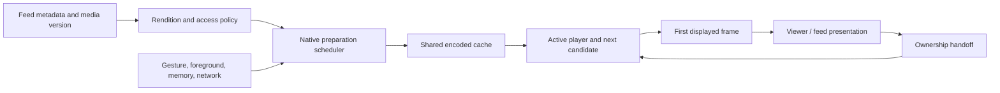

# Instagram + TikTok: delivery architecture and implementation plan

2026-09-19. This supersedes the implementation sequence in [the Instagram research](instagram-media-architecture-research-2026-09-19.md), which retains its source inventory and earlier device audit. This is a reconstruction from published engineering work and our code/device evidence. No current TikTok binary or private server configuration was inspected.

## Decision

Keep React Native for product screens. Build and measure a small native playback foundation: continuous looping, explicit player ownership, bounded preparation, and a lightweight presentation surface. Native paging is conditional on the remaining mount cost. A CDN or complete UI rewrite is not yet justified by our measurements.

The user’s pending mobile changes were copied into the isolated `feat/media-playback-native` branch, based on `21c9aed2`. That preserves the newer real-player return path and Android underlay work. The primary checkout and production release are not the implementation target. This document does not certify what is live.

## 1. What TikTok adds

### Historical measurements of the actual app

The NSDI 2023 **Dashlet** paper studied TikTok v20.9.1. It describes manifests of ten videos, a high-water mark of five buffered first chunks, and size-based chunks: the first 1 MB, then the remainder; smaller files fit in one chunk. The researchers also observed buffer depletion and idle periods. These are historical observations of encoded data, not five simultaneous decoders or ten fully downloaded videos. Their comparison with v26.3.3 used encrypted aggregate traffic, which limits conclusions. Dashlet’s proposed scheduler is the researchers’ improvement, not a TikTok implementation. None of these constants establishes TikTok’s September 2026 policy. [Primary paper, §2 and §5](https://www.usenix.org/system/files/nsdi23-li-zhuqi.pdf).

### ByteDance-related SDK guidance

BytePlus describes its Player SDK as proven in TikTok. That is a vendor statement about related technology, not a complete current TikTok architecture. The suite documents preloading, prerendering, hardware decoding and playback telemetry. [SDK overview, February 2026](https://docs.byteplus.com/en/docs/byteplus-vod/docs-player-sdk-overview).

Its Android short-video guidance recommends **three upcoming videos, 800 kB each**, starting after the current video has over 20 seconds buffered or is fully buffered. It cancels speculative work on a swipe, requires matching playback/preload identities, and defaults to one preload request at a time. Those are SDK recommendations, not verified TikTok production settings. [Custom preload guidance](https://docs.byteplus.com/en/docs/byteplus-vod/docs-custom-preloading-android).

The iOS SDK distinguishes byte preloading from preparing a player to decode and render the **next** video. Its documented prerender path does not support the previous item. This is a useful concrete distinction between downloading ahead and spending decoder resources ahead. [iOS short-video practices](https://docs.byteplus.com/en/docs/byteplus-vod/docs-ios-player-short-video-best-practices).

The React Native wrapper exposes native strategy setup, reuse of a prerendered player/frame, and clearing strategies on departure. This demonstrates that this architecture can sit beneath React Native; it does not prove TikTok’s feed uses React Native. Some capabilities require its paid Premium edition. We are not adopting that dependency. [RN strategy documentation](https://docs.byteplus.com/api/docs/byteplus-vod/docs-rn-player-basic-features).

### CDN, encoding and playback

BytePlus VOD documents upload, storage, transcoding, CDN distribution and playback as separate stages, including H.264/H.265 and MP4/HLS/DASH outputs. It supports its own or third-party origins and URL authentication. This describes a commercial service, not TikTok’s exact CDN vendors, regional routing, cache TTLs or origin topology. [VOD architecture](https://docs.byteplus.com/en/docs/byteplus-vod/docs-what-is-byteplus-vod).

Its feature matrix separately documents adaptive bitrate, dynamic buffers, local caching and prerendering. Those are available building blocks; current TikTok choices per device, codec and surface remain unknown. [Player feature matrix](https://docs.byteplus.com/en/docs/byteplus-vod/docs-player-features).

## 2. Combined conclusion

| Question | Instagram evidence | TikTok / related evidence | Magicbooklet decision |
| --- | --- | --- | --- |
| How much is downloaded ahead? | Current Android adjacent preparation; exact count unpublished | Historical five startup chunks; separate SDK recommendation of three × 800 kB | Tune by bytes/time and current starvation, not a copied count |
| How many full players? | Media3 preparation reduces dependence on multiple warm players | SDK separates preload from prerender | Track players, queue items, surfaces and encoded bytes separately |
| Native playback? | Android Media3; custom iOS HDR path documented | Native SDKs and cross-platform wrappers documented | AVFoundation / Media3 behind the existing React Native screens |
| Open/close ownership? | Exact private implementation unknown | Exact private implementation unknown | Preserve one player, first displayed frame and source geometry across handoff |
| Native list/screen inventory? | IGListKit and sampled Android pager/Litho evidence | Current full inventory unverified | Convert a screen only when a trace attributes its cost |
| CDN migration? | QUIC/encoding work documented | Delivery stack and cache strategies documented | Measure our rendition size, TTFB, range behavior and cache hit rate first |

Instagram references: [Google’s Media3 case study](https://android-developers.googleblog.com/2026/03/instagram-and-facebook-deliver-instant.html), [Meta iOS HDR renderer](https://engineering.fb.com/2025/11/17/ios/enhancing-hdr-on-instagram-for-ios-with-dolby-vision/), [IGListKit](https://github.com/Instagram/IGListKit).

## 3. Target architecture

Our proposed initial policy is one active video, one next candidate prepared, and the previous candidate retained only within the same budget. Further candidates get posters or bounded encoded bytes, not a player each. Start an experiment at 2–3 seconds of prepared media and one speculative request; these are our hypotheses, not borrowed production constants. Active playback starvation cancels speculative work. Direction reversal changes priority. Backgrounding and memory pressure release inactive resources. Never share authenticated cache identities across access boundaries.

Do not implement arbitrary HTTP-range prefetch alongside Expo’s cache: a second cache would download the same data twice. Android preparation must use Expo’s pinned Media3 version and shared media-source/cache/load-control components. iOS needs equivalent cancellation and measured resource accounting. Network buffering targets are not strict byte caps.

## 4. Native component decisions

**Prototyped, held from rollout:** iOS MP4 queue looping inside the existing Expo player, preserving cache asset and logical source identity. The physical fixture showed negligible median gain and more queued items; the integrated trace did not establish smooth presentation. The default remains the existing seek loop. Continue the current player loan/return state machine.

**Next measured prototype:** Android compressed-sample preloading and a smaller native video host. A prepared source should not require inflating a controls-heavy player view. Preserve TextureView behavior where shared transforms require it.

**Conditional:** native vertical pager / viewer shell if settling still spends over a frame mounting React content after playback fixes. Preserve dynamic captions, accessibility, gestures, creator navigation and close geometry in the experiment.

**Retain current components:** comments, profile information, settings, marketplace, forms and other product UI. Existing navigation, gestures, images and video already have native implementations beneath their JS APIs. Camera/editor/background uploads require separate evidence and scope.

## 5. Ordered implementation and release gates

1. **Baseline identity:** record source commit plus copied working changes; label every local binary, flag and device. Later compare the actual released runtime separately. Prior measurements are useful diagnosis, not proof of current release behavior.
2. **iOS loop decision:** retain the opt-in AVQueuePlayer/AVPlayerLooper probe as research and keep it disabled. The source identity, cancellation and fallback implementation compiled and passed fixture lifecycle checks, but the measured benefit did not pass the rollout gate. Revisit only after exact-build displayed-frame A/B results warrant it.
3. **Preparation scheduler:** build counters and cancelable leases before increasing prefetch. Compare startup, reversal, rebuffering, unused bytes, live decoders and memory. Stop speculative work when it competes with the current video. This is the next native implementation candidate.
4. **Presentation:** measure open flight, landing mount, swipe settle and close independently. Prototype a lighter host or native pager only for the remaining attributed cost. Preserve the source frame until the destination reports a displayed frame.
5. **Store rollout:** keep independent capability/feature switches and an old-engine fallback. Native changes require a new store build/runtime; follow the repository release process. Never publish an OTA to an arbitrary fingerprint. No deployment is part of this local implementation pass.

Acceptance: at least 20 consecutive loop boundaries without an attributable gap beyond one extra source-frame interval; 30 open/close cycles per primary entry surface with at least 99% on-time animation frames; warm next first display p95 ≤100 ms; no black frame, rewind, double audio or orphan player. Run a 100-cycle resource soak; report thermal state, memory and bytes. Compare 60 Hz and 120 Hz separately. Simulator checks establish function; physical measurements establish performance. A failure keeps that feature disabled.

## 6. Verification record

See [implementation evidence](../audits/native-media-implementation-2026-09-19.md) for actual changes, tests and unresolved gates. Planned native scheduler/pager work must not be reported as implemented merely because this plan exists.
