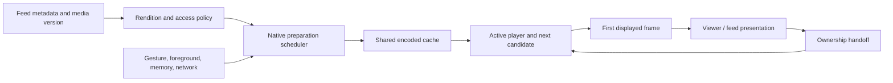

# Instagram + TikTok: delivery architecture and implementation plan

2026-09-19. This supersedes the implementation sequence in [the Instagram research](instagram-media-architecture-research-2026-09-19.md), which retains its source inventory and earlier device audit. This is a reconstruction from published engineering work and our code/device evidence. No current TikTok binary or private server configuration was inspected.

## Decision

Keep React Native for product screens. Take the two attributed costs that ship over the air first: the reel’s first mount at landing and the Android per-frame draw list. Then build and measure a small native playback foundation: explicit player ownership, a lightweight presentation surface, and bounded preparation only if a startup or rebuffering baseline calls for it. Continuous looping stays a held prototype (section 4). Native paging is conditional on the remaining mount cost. A CDN or complete UI rewrite is not yet justified by our measurements.

The isolated `feat/media-playback-native` branch was created from `21c9aed2` with the user’s then-pending mobile changes copied in, and reset onto `e451b066` (#180) once those changes merged; its commits sit on that baseline. #180 was promoted to production and published over the air on 2026-09-19, so the real-player return path and Android underlay cut are live. The primary checkout and production release are not the implementation target. Beyond that, this document does not certify what is live.

## 1. What TikTok adds

### Historical measurements of the actual app

The NSDI 2023 **Dashlet** paper studied TikTok v20.9.1. It describes manifests of ten videos, a high-water mark of five buffered first chunks, and size-based chunks: the first 1 MB, then the remainder; smaller files fit in one chunk. The researchers also observed buffer depletion and idle periods. These are historical observations of encoded data, not five simultaneous decoders or ten fully downloaded videos. Their comparison with v26.3.3 used encrypted aggregate traffic, which limits conclusions. Dashlet’s proposed scheduler is the researchers’ improvement, not a TikTok implementation. None of these constants establishes TikTok’s September 2026 policy. [Primary paper, §2 and §5](https://www.usenix.org/system/files/nsdi23-li-zhuqi.pdf).

### ByteDance-related SDK guidance

BytePlus describes its Player SDK as proven in TikTok. That is a vendor statement about related technology, not a complete current TikTok architecture. The suite documents preloading, prerendering, hardware decoding and playback telemetry. [SDK overview, February 2026](https://docs.byteplus.com/en/docs/byteplus-vod/docs-player-sdk-overview).

Its Android short-video guidance recommends **three upcoming videos, 800 kB each**, starting after the current video has over 20 seconds buffered or is fully buffered. It cancels speculative work on a swipe, requires matching playback/preload identities, and defaults to one preload request at a time. Those are SDK recommendations, not verified TikTok production settings. [Custom preload guidance](https://docs.byteplus.com/en/docs/byteplus-vod/docs-custom-preloading-android).

The iOS SDK distinguishes byte preloading from preparing a player to decode and render the **next** video. Its documented prerender path does not support the previous item. This is a useful concrete distinction between downloading ahead and spending decoder resources ahead. [iOS short-video practices](https://docs.byteplus.com/en/docs/byteplus-vod/docs-ios-player-short-video-best-practices).

The React Native wrapper exposes native strategy setup, reuse of a prerendered player/frame, and clearing strategies on departure. This demonstrates that this architecture can sit beneath React Native; it does not prove TikTok’s feed uses React Native. Some capabilities require its paid Premium edition. We are not adopting that dependency. [RN strategy documentation](https://docs.byteplus.com/api/docs/byteplus-vod/docs-rn-player-basic-features).

### CDN, encoding and playback

BytePlus VOD documents upload, storage, transcoding, CDN distribution and playback as separate stages, including H.264/H.265 and MP4/HLS/DASH outputs. It supports its own or third-party origins and URL authentication. This describes a commercial service, not TikTok’s exact CDN vendors, regional routing, cache TTLs or origin topology. [VOD architecture](https://docs.byteplus.com/en/docs/byteplus-vod/docs-what-is-byteplus-vod).

Its feature matrix separately documents adaptive bitrate, dynamic buffers, local caching and prerendering. Those are available building blocks; current TikTok choices per device, codec and surface remain unknown. [Player feature matrix](https://docs.byteplus.com/en/docs/byteplus-vod/docs-player-features).

## 2. Combined conclusion

| Question | Instagram evidence | TikTok / related evidence | Magicbooklet decision |
| --- | --- | --- | --- |
| How much is downloaded ahead? | Current Android adjacent preparation; exact count unpublished | Historical five startup chunks; separate SDK recommendation of three × 800 kB | Tune by bytes/time and current starvation, not a copied count |
| How many full players? | Media3 preparation reduces dependence on multiple warm players | SDK separates preload from prerender | Track players, queue items, surfaces and encoded bytes separately |
| Native playback? | Android Media3; custom iOS HDR path documented | Native SDKs and cross-platform wrappers documented | AVFoundation / Media3 behind the existing React Native screens |
| Open/close ownership? | Exact private implementation unknown | Exact private implementation unknown | Preserve one player, first displayed frame and source geometry across handoff |
| Native list/screen inventory? | IGListKit and sampled Android pager/Litho evidence | Current full inventory unverified | Convert a screen only when a trace attributes its cost |
| CDN migration? | QUIC/encoding work documented | Delivery stack and cache strategies documented | Measure our rendition size, TTFB, range behavior and cache hit rate first |

Instagram references: [Google’s Media3 case study](https://android-developers.googleblog.com/2026/03/instagram-and-facebook-deliver-instant.html), [Meta iOS HDR renderer](https://engineering.fb.com/2025/11/17/ios/enhancing-hdr-on-instagram-for-ios-with-dolby-vision/), [IGListKit](https://github.com/Instagram/IGListKit).

## 3. Target architecture

Our proposed initial policy is one active video, one next candidate prepared, and the previous candidate retained only within the same budget. Further candidates get posters or bounded encoded bytes, not a player each. Start an experiment at 2–3 seconds of prepared media and one speculative request; these are our hypotheses, not borrowed production constants. Active playback starvation cancels speculative work. Direction reversal changes priority. Backgrounding and memory pressure release inactive resources. Never share authenticated cache identities across access boundaries.

Do not implement arbitrary HTTP-range prefetch alongside Expo’s cache: a second cache would download the same data twice. Android preparation must use Expo’s pinned Media3 version (1.8.0 in expo-video 55.0.21, which carries `DefaultPreloadManager`) and shared media-source/cache/load-control components. Those components are built inside expo-video’s Kotlin `VideoPlayer`, so sharing them means patching that Kotlin, and expo-video ships prebuilt on Android: its `expo-module.config.json` carries an `android.publication` entry, so the Expo Gradle plugin takes the bundled AAR from `local-maven-repo` and a `patches/` change to the Kotlin is silently ignored (this bit expo-image on 2026-09-18). The patch must also drop that `publication` entry, or `expo.autolinking.buildFromSource` must list the package, which moves both platforms’ fingerprints. Confirm the change in the dex, not the build log. iOS needs equivalent cancellation and measured resource accounting. Network buffering targets are not strict byte caps.

## 4. Native component decisions

**Prototyped, held from rollout:** iOS MP4 queue looping inside the existing Expo player, preserving cache asset and logical source identity. On the silent, synthetic 320×480 fixture the phone showed the same 50 ms boundary in both modes, so the fixture found no gain, and queue mode holds more items; the integrated trace was too brief to attribute anything. That is a fixture result, not a production-media result: the exact-build displayed-frame A/B on real renditions (720p, audio, 2 s keyframes) is still owed, and until it runs the default remains the existing seek loop. The experiment’s native changes live outside `patches/`, in `ugc-mobile/experiments/seamless-loop/patches/`, so they move no shipped fingerprint (section 5, step 6). Continue the current player loan/return state machine.

**Next, over the air:** view count, not draw ops. Measured on the S24 on 2026-09-19 (see the implementation evidence): every `*Op` slice together is about 0.6 ms of a 9 ms reel frame; the frame is the renderer’s tree walk and display-list replay over some 1,300 views. Caching the rail and caption as hardware layers took 14 draw ops off every frame and changed nothing else, while adding to the walk and putting its allocations into the open, so that item is closed as a negative result. Taking the hidden tab screen out of layout once the reel rests did cut the walk (prepareTree 2.2 → 1.4–1.8 ms, syncFrameState 3.4 → 2.6–2.7 ms) and shipped on this branch. What remains is the reel’s own ~850 views for three slides against Instagram’s 144: the reel’s first mount at landing (`IconShadow` draws every rail icon as two SVG trees; chrome that is not visible should wait until the reel settles) and the neighbour slides’ chrome are the same lever. SurfaceView for the settled reel remains the alternative for the video’s own draw.

**Done, awaiting the store build:** the smaller Android video host, as `ugc-mobile/plugins/withAndroidLightPlayerView.js`. It overrides expo-video’s two `PlayerView` layouts by name with a `player_layout_id` that keeps the content frame, the shutter and a `PlayerControlView` with an empty layout (expo-video calls Media3’s controller setters at construction, so the controller must exist; its own helpers null-check every button but the fullscreen one, which stays hidden). Measured on the S24 on 2026-09-19: 38 → 6 descendants per player, warm creation 4.6–5.1 → 1.4–2.5 ms and the open’s first creation 10–22 → 3 ms, video and hand-back intact. TextureView behavior is unchanged. It is registered in `app.json` only in the commit a store build is made from (step 6), because registering it moves both runtime fingerprints. Compressed-sample preloading is conditional: no measurement so far shows next-video first display or rebuffering as a problem (renditions are faststart H.264 at most 720p on a CDN hit, and the one first-swipe drop was neighbour-slide mount time on the main thread), so build the scheduler only once the baseline in section 5 records a startup or rebuffering number above target.

The host experiment is now scoped to controls-off feed and reel views. It does not replace Expo's standard view or its native controls, so creation previews and the media lightbox retain play, pause, seek and fullscreen behavior. The release APK compiled from the Kotlin source and launched on the connected S24; the final FrameTimeline comparison remains a store-build gate.

**Conditional:** native vertical pager / viewer shell if settling still spends over a frame mounting React content after playback fixes. Preserve dynamic captions, accessibility, gestures, creator navigation and close geometry in the experiment.

**Retain current components:** comments, profile information, settings, marketplace, forms and other product UI. Existing navigation, gestures, images and video already have native implementations beneath their JS APIs. Camera/editor/background uploads require separate evidence and scope.

## 5. Ordered implementation and release gates

1. **Baseline identity:** record source commit plus copied working changes; label every local binary, flag and device. Later compare the actual released runtime separately. Measured 2026-09-19 on the S24 with this branch’s build (`.dev` release from `main` `e451b066` plus the branch’s JS): after a swipe the next video’s prepared frame is already on screen and its player renders within 2–26 ms of the swipe input; motion resumes about 130 ms after the snap; no decode gap over 45 ms in the following 1.5 s. Prior measurements are useful diagnosis, not proof of current release behavior.
2. **iOS loop decision:** retain the opt-in AVQueuePlayer/AVPlayerLooper probe as research and keep it disabled. The source identity, cancellation and fallback implementation compiled and passed fixture lifecycle checks, but the fixture showed no gain and the integrated run was too brief to judge presentation. Revisit only after exact-build displayed-frame A/B results on production renditions warrant it.
3. **Mount and view-count cuts (over the air):** the hidden tab screen’s layout detach is done (2026-09-19, S24 A/B in the implementation evidence). Next the reel’s own view count from section 4, plus the config-plugin `PlayerView` layout when a store build is next. Gate on `prepareTree` and `syncFrameState` per frame, landing mount frames and late frames per swipe, measured before and after with the Perfetto FrameTimeline and Instruments recipes from the 2026-09-18 check-up; the median RenderThread frame moves ±1 ms between identical runs, so read the component slices.
4. **Preparation scheduler (conditional, not triggered):** only if step 1 records warm next first display above 100 ms p95 or rebuffering on Wi-Fi. Step 1’s numbers are under both, so this step is skipped until a released-runtime baseline says otherwise. If it does, build counters and cancelable leases before increasing prefetch. Compare startup, reversal, rebuffering, unused bytes, live decoders and memory. Stop speculative work when it competes with the current video. On Android this needs the source build noted in section 3.
5. **Presentation:** measure open flight, landing mount, swipe settle and close independently. The lighter Android host is done (section 4, the light `PlayerView` plugin). A native pager stays conditional on the landing mount cost that remains after the view-count work in step 3. Preserve the source frame until the destination reports a displayed frame.
6. **Store rollout:** keep independent capability/feature switches and an old-engine fallback. Native changes require a new store build/runtime; follow the repository release process. Never publish an OTA to an arbitrary fingerprint. Native experiments stay outside `patches/` until the store build that carries them: `@expo/fingerprint` hashes `patches/` for both platforms and the autolinked native folders under `node_modules`, so an experimental patch landed on `main` moves the iOS runtime fingerprint and strands every JS-only iOS update until the next binary ships (verified 2026-09-19: `main` fingerprints iOS to `c2e22bfa`, the shipped build 52, while the combined patch fingerprinted `59ba532f`). Graduate an experiment into `patches/` only in the commit a store build is made from, and update `ota-targets.json` when that binary ships. The next store build’s commit registers `./plugins/withAndroidLightPlayerView` in `app.json`, and moves the looper experiment into `patches/` only if step 2’s A/B warrants it. No deployment is part of this local implementation pass.

Acceptance: at least 20 consecutive loop boundaries each within one source-frame interval in total (33.3 ms on a 30 fps clip, so the 50 ms boundaries the probe measured fail), read from presentation, Instruments display-surface swap gaps or Perfetto FrameTimeline, not from decoded-sample availability, on production renditions rather than the probe fixture; 30 open/close cycles per primary entry surface with at least 99% on-time animation frames; warm next first display p95 ≤100 ms; no black frame, rewind, double audio or orphan player. Run a 100-cycle resource soak; report thermal state, memory and bytes. Compare 60 Hz and 120 Hz separately. Simulator checks establish function; physical measurements establish performance. A failure keeps that feature disabled.

## 6. Verification record

See [implementation evidence](../audits/native-media-implementation-2026-09-19.md) for actual changes, tests and unresolved gates. Planned native scheduler/pager work must not be reported as implemented merely because this plan exists.
