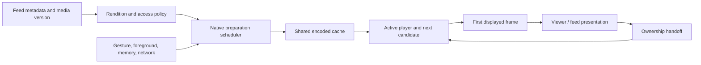

# Instagram + TikTok: delivery architecture and implementation plan

2026-09-19. This supersedes the implementation sequence in [the Instagram research](../research/instagram-media-architecture-research-2026-09-19.md), which retains its source inventory and earlier device audit. This is a reconstruction from published engineering work and our code/device evidence. No current TikTok binary or private server configuration was inspected.

## Decision

Keep React Native for product screens. Take the two attributed costs that ship over the air first: the reel’s first mount at landing and the Android per-frame draw list. Then build and measure a small native playback foundation: explicit player ownership, a lightweight presentation surface, and bounded preparation only if a startup or rebuffering baseline calls for it. Continuous looping stays a held prototype (section 4). Native paging is conditional on the remaining mount cost. A CDN or complete UI rewrite is not yet justified by our measurements.

The isolated `feat/media-playback-native` branch was created from `21c9aed2` with the user’s then-pending mobile changes copied in, and reset onto `e451b066` (#180) once those changes merged; its commits sit on that baseline. #180 was promoted to production and published over the air on 2026-09-19, so the real-player return path and Android underlay cut are live. The primary checkout and production release are not the implementation target. Beyond that, this document does not certify what is live.

## 1. What TikTok adds

### Historical measurements of the actual app

The NSDI 2023 **Dashlet** paper studied TikTok v20.9.1. It describes manifests of ten videos, a high-water mark of five buffered first chunks, and size-based chunks: the first 1 MB, then the remainder; smaller files fit in one chunk. The researchers also observed buffer depletion and idle periods. These are historical observations of encoded data, not five simultaneous decoders or ten fully downloaded videos. Their comparison with v26.3.3 used encrypted aggregate traffic, which limits conclusions. Dashlet’s proposed scheduler is the researchers’ improvement, not a TikTok implementation. None of these constants establishes TikTok’s September 2026 policy. [Primary paper, §2 and §5](https://www.usenix.org/system/files/nsdi23-li-zhuqi.pdf).

### ByteDance-related SDK guidance

BytePlus describes its Player SDK as proven in TikTok. That is a vendor statement about related technology, not a complete current TikTok architecture. The suite documents preloading, prerendering, hardware decoding and playback telemetry. [SDK overview, February 2026](https://docs.byteplus.com/en/docs/byteplus-vod/docs-player-sdk-overview).

Its Android short-video guidance recommends **three upcoming videos, 800 kB each**, starting after the current video has over 20 seconds buffered or is fully buffered. It cancels speculative work on a swipe, requires matching playback/preload identities, and defaults to one preload request at a time. Those are SDK recommendations, not verified TikTok production settings. [Custom preload guidance](https://docs.byteplus.com/en/docs/byteplus-vod/docs-custom-preloading-android).

The iOS SDK distinguishes byte preloading from preparing a player to decode and render the **next** video. Its documented prerender path does not support the previous item. This is a useful concrete distinction between downloading ahead and spending decoder resources ahead. [iOS short-video practices](https://docs.byteplus.com/en/docs/byteplus-vod/docs-ios-player-short-video-best-practices).

The React Native wrapper exposes native strategy setup, reuse of a prerendered player/frame, and clearing strategies on departure. This demonstrates that this architecture can sit beneath React Native; it does not prove TikTok’s feed uses React Native. Some capabilities require its paid Premium edition. We are not adopting that dependency. [RN strategy documentation](https://docs.byteplus.com/api/docs/byteplus-vod/docs-rn-player-basic-features).

### Reddit’s published Android techniques

Reddit’s engineers describe, for their native Android app, prefetching (encoded bytes ahead of the viewport, tried as one, two or three posts ahead against lazy prefetch), **prewarming** (calling `prepare()` on a player before its post enters the viewport, which is our prepared neighbour), player creation costing over ~200 ms on the main thread in production traces, and Media3 1.6’s `LoadControl` defaults needing about 60 % less buffered data to start; together they report roughly a 50 % cut in video start time. The counts were chosen by experiment on their telemetry, not by rule. [ProAndroidDev, November 2025](https://proandroiddev.com/taking-exoplayer-further-reddits-performance-techniques-f426fdafb471), [droidcon mirror](https://www.droidcon.com/2025/11/26/taking-exoplayer-further-reddits-performance-techniques/). Our pinned Media3 1.8.0 already carries those defaults; the lesson we take is the method: a fleet start-time metric first, prefetch counts second.

### CDN, encoding and playback

BytePlus VOD documents upload, storage, transcoding, CDN distribution and playback as separate stages, including H.264/H.265 and MP4/HLS/DASH outputs. It supports its own or third-party origins and URL authentication. This describes a commercial service, not TikTok’s exact CDN vendors, regional routing, cache TTLs or origin topology. [VOD architecture](https://docs.byteplus.com/en/docs/byteplus-vod/docs-what-is-byteplus-vod).

Its feature matrix separately documents adaptive bitrate, dynamic buffers, local caching and prerendering. Those are available building blocks; current TikTok choices per device, codec and surface remain unknown. [Player feature matrix](https://docs.byteplus.com/en/docs/byteplus-vod/docs-player-features).

## 2. Combined conclusion

| Question | Instagram evidence | TikTok / related evidence | Magicbooklet decision |
| --- | --- | --- | --- |
| How much is downloaded ahead? | Current Android adjacent preparation; exact count unpublished | Historical five startup chunks; separate SDK recommendation of three × 800 kB | Tune by bytes/time and current starvation, not a copied count |
| How many full players? | Media3 preparation reduces dependence on multiple warm players | SDK separates preload from prerender | Track players, queue items, surfaces and encoded bytes separately |
| Native playback? | Android Media3; custom iOS HDR path documented | Native SDKs and cross-platform wrappers documented | AVFoundation / Media3 behind the existing React Native screens |
| Open/close ownership? | Exact private implementation unknown | Exact private implementation unknown | Preserve one player, first displayed frame and source geometry across handoff |
| Native list/screen inventory? | IGListKit and sampled Android pager/Litho evidence | Current full inventory unverified | Convert a screen only when a trace attributes its cost |
| CDN migration? | QUIC/encoding work documented | Delivery stack and cache strategies documented | Measure our rendition size, TTFB, range behavior and cache hit rate first |

Instagram references: [Google’s Media3 case study](https://android-developers.googleblog.com/2026/03/instagram-and-facebook-deliver-instant.html), [Meta iOS HDR renderer](https://engineering.fb.com/2025/11/17/ios/enhancing-hdr-on-instagram-for-ios-with-dolby-vision/), [IGListKit](https://github.com/Instagram/IGListKit).

## 3. Target architecture

Our proposed initial policy is one active video, one next candidate prepared, and the previous candidate retained only within the same budget. Further candidates get posters or bounded encoded bytes, not a player each. Start an experiment at 2–3 seconds of prepared media and one speculative request; these are our hypotheses, not borrowed production constants. Active playback starvation cancels speculative work. Direction reversal changes priority. Backgrounding and memory pressure release inactive resources. Never share authenticated cache identities across access boundaries.

Do not implement arbitrary HTTP-range prefetch alongside Expo’s cache: a second cache would download the same data twice. Android preparation must use Expo’s pinned Media3 version (1.8.0 in expo-video 55.0.21, which carries `DefaultPreloadManager`) and shared media-source/cache/load-control components. Those components are built inside expo-video’s Kotlin `VideoPlayer`, so sharing them means patching that Kotlin, and expo-video ships prebuilt on Android: its `expo-module.config.json` carries an `android.publication` entry, so the Expo Gradle plugin takes the bundled AAR from `local-maven-repo` and a `patches/` change to the Kotlin is silently ignored (this bit expo-image on 2026-09-18). The patch must also drop that `publication` entry, or `expo.autolinking.buildFromSource` must list the package, which moves both platforms’ fingerprints. Confirm the change in the dex, not the build log. iOS needs equivalent cancellation and measured resource accounting. Network buffering targets are not strict byte caps.

## 4. Native component decisions

**Prototyped, measured, held:** iOS MP4 queue looping inside the existing Expo player, preserving cache asset and logical source identity. The exact-build A/B on production renditions ran on 2026-09-19 (iPhone 16e, the 3.06 s kungfu-cats clip, Instruments display-surface swaps, 11 s windows): the default seek loop showed a 50–67 ms gap at every one of its four boundaries; the looper build showed a 50 ms gap at three of its four. That fails the one-source-frame acceptance on both sides and shows no gain, so the looper stays disabled (implementation evidence, completion pass 2). On the silent, synthetic 320×480 fixture the phone showed the same 50 ms boundary in both modes, so the fixture found no gain, and queue mode holds more items; the integrated trace was too brief to attribute anything. That is a fixture result, not a production-media result: the exact-build displayed-frame A/B on real renditions (720p, audio, 2 s keyframes) is still owed, and until it runs the default remains the existing seek loop. The experiment’s native changes live outside `patches/`, in `ugc-mobile/experiments/seamless-loop/patches/`, so they move no shipped fingerprint (section 5, step 6). Continue the current player loan/return state machine.

**Next, over the air:** view count, not draw ops. Measured on the S24 on 2026-09-19 (see the implementation evidence): every `*Op` slice together is about 0.6 ms of a 9 ms reel frame; the frame is the renderer’s tree walk and display-list replay over some 1,300 views. Caching the rail and caption as hardware layers took 14 draw ops off every frame and changed nothing else, while adding to the walk and putting its allocations into the open, so that item is closed as a negative result. Taking the hidden tab screen out of layout once the reel rests did cut the walk (prepareTree 2.2 → 1.4–1.8 ms, syncFrameState 3.4 → 2.6–2.7 ms) and shipped on this branch. What remains is the reel’s own ~850 views for three slides against Instagram’s 144: the reel’s first mount at landing (`IconShadow` draws every rail icon as two SVG trees; chrome that is not visible should wait until the reel settles) and the neighbour slides’ chrome are the same lever. SurfaceView for the settled reel remains the alternative for the video’s own draw.

**Done, awaiting the store build:** the smaller Android video host, as the scoped native hosts in `ugc-mobile/experiments/android-light-player-view/` (a patch to expo-video: `LightTextureVideoView` / `LightSurfaceVideoView` inflating a `player_layout_id` that keeps the content frame, the shutter and a `PlayerControlView` with an empty layout; the JS wrapper selects them only for `nativeControls={false}` and only when the binary advertises `supportsLightweightViews`, so creation previews and the lightbox keep Expo’s full controls and an older binary keeps its stock views). A first version overrode expo-video’s layouts app-wide and would have stripped those controls; it was replaced. Measured on the S24 on 2026-09-19 with the patch built from source: `PlayerView` 38 → 6 descendants, creation 4.6–5.1 → 1.3–2.5 ms warm and the open’s first 10–22 → 3.3 ms, video and hand-back intact. The patch removes expo-video’s prebuilt `publication` so Gradle compiles the Kotlin; it moves both runtime fingerprints and goes into `patches/` only in the commit a store build is made from (step 6). The rail’s static icons are now bundled rasters (`scripts/generate-reel-icons.mjs`, `components/reel-icon.tsx`): one image view instead of two SVG trees each, viewer screen 892 → 740 views, SVG roots on screen 96 → 65; over the air. The neighbour slides’ chrome now leaves the draw walk while the reel is at rest (`lib/reel-neighbour-chrome.ts`: `display: none` until a drag begins, shown again for the swipe, hidden once the index settles; the landed slide is always shown by its own prop), which removes the other two slides’ rail and caption, about two fifths of the reel’s views, from every idle frame; over the air, S24 measurement pending the phone’s USB authorisation. Fleet playback metrics ship over the air too (section 5, step 7).

The host experiment is now scoped to controls-off feed and reel views. It does not replace Expo's standard view or its native controls, so creation previews and the media lightbox retain play, pause, seek and fullscreen behavior. The release APK compiled from the Kotlin source and launched on the connected S24; the final FrameTimeline comparison remains a store-build gate.

**Conditional:** native vertical pager / viewer shell if settling still spends over a frame mounting React content after playback fixes. Preserve dynamic captions, accessibility, gestures, creator navigation and close geometry in the experiment.

**Retain current components:** comments, profile information, settings, marketplace, forms and other product UI. Existing navigation, gestures, images and video already have native implementations beneath their JS APIs. Camera/editor/background uploads require separate evidence and scope.

## 4b. Delivery coverage: what the large feeds run, and where it lives here

| Layer | Instagram and TikTok | Magicbooklet | Owner |
| --- | --- | --- | --- |
| Edge CDN | Long-TTL edge cache, purge on takedown | Cloudflare in front of Storage: public media hit, one-day public and one-year private TTLs, ranges served from the edge, purge wired; APIs hit on Vercel | CDN audit 2026-09-10; CDN-3 private-TTL contract still open |
| Client video cache | Disk LRU shared by prefetch and playback | expo-video `useCaching` in feed and viewer: Media3 LRU on Android, the AVAsset loader cache on iOS, 1 GB each; the two-byte range patch (`patches/expo-video+55.0.21+001`) ends iOS double downloads | Shipped in iOS build 52 |
| Images | Memory and disk, sized renditions | expo-image memory-disk; 720 px previews, 1440 px WebP display renditions; jittered retry | Media audit F3, live since #180 |
| Encoding | Ladders, faststart, byte ranges | One 720p H.264 rendition, CRF 30, 1.4 Mb/s cap, 2 s keyframes, mono AAC, faststart, 206 on every object; teasers over 30 s | `src/lib/video-rendition.ts` |
| Prefetch | First chunk of the next few items | Feed: two paused prepared players, 3 s head, 8 s once playing; viewer: neighbour slides mounted, next one prepared | Step 4, gated |
| Presentation | Native hosts, flat draw lists | Light hosts, icon rasters, covered-screen detach (the neighbour-chrome detach was removed on 2026-09-24, step 3) | Steps 3 and 5 |
| Playback telemetry | Start-up, rebuffer and cache dashboards | Per-session aggregates from every phone (step 7) | This plan |
| Adaptive bitrate | DASH ladders, network-aware selection | None: one rendition, no step-down on weak cellular | Step 8, gated on step 7 |
| Transport | QUIC | Android through OkHttp (HTTP/2); iOS URLSession (HTTP/3 capable); Android HTTP/3 would need Cronet | Unmeasured |

Their private pieces (FBCDN, ByteDance’s CDN, their encoders and preload managers) are not for sale; TikTok’s is sold as BytePlus VOD, a native SDK that would replace the viewer’s playback layer and is not taken up. The player engines are already theirs: Media3 and AVPlayer are what expo-video wraps. expo-video’s cache cannot be used with HLS on iOS, so a video platform (Cloudflare Stream, Mux) that serves HLS trades that cache away and must be measured before it ships; it becomes worth deciding when step 7 shows cellular rebuffering or egress nears the wall.

## 5. Ordered implementation and release gates

Execution order, both platforms. Over-the-air steps go first because they reach every installed build; native steps are batched into one store build.

| Step | Android | iOS | State on 2026-09-19 |
| --- | --- | --- | --- |
| 1 Baseline | S24 traces: prepared next frame on screen, player renders within 2–26 ms of the swipe, motion resumes ~130 ms after the snap, no decode gap over 45 ms in 1.5 s | iPhone 16e: seek-loop boundary 50–67 ms; opens and swipes clean in the 09-18 check-up | Done |
| 2 iOS loop | n/a (ExoPlayer repeat path) | Exact-build A/B on production renditions: no gain (section 4) | Done, held |
| 3 View count (OTA) | Tab-screen layout detach, icon rasters (892 → 740 views); the neighbour-chrome detach shipped in 0.1.5 and was removed on 2026-09-24 | Same JS | Done, shipped in 0.1.5. The S24 re-measure (2026-09-24) found the neighbour detach’s reveal, a layout pass at each drag’s first touch, slowed the reel following the finger: a median 47 ms with it, 33 ms without, over alternated runs. Its gain, ~2 ms of each resting video frame’s 33 ms, is not felt, so it was taken out. Every swipe still builds one slide’s rail and caption (~110–140 views) during the drag; cutting that count is next |
| 4 Preparation scheduler | Media3 `DefaultPreloadManager`, source build | AVPlayer preroll | Skipped: warm next first display under the 100 ms gate; revisit on step 7 data |
| 5 Presentation | Scoped light hosts, `PlayerView` 38 → 6 descendants, creation 1.3–3.3 ms | Unchanged (AVPlayerLayer host is already lean) | Done, awaiting the store build |
| 6 Store build | Light-host patch graduated into `patches/` as the sequenced `expo-video+55.0.21+002+android-light-player-view.patch`; `expo.autolinking.android.buildFromSource: [expo-video]` | `expo.autolinking.ios.buildFromSource: [expo-video]` so SDK 56’s precompiled modules cannot silently drop the range-cache patch; expo-network added for the network dimension of step 7 | With testers since 2026-09-19 as 0.1.5 from `main` `74f4bba` (#181): Android 72 on the Play closed alpha (fingerprint `7a2df8d1`), iOS 53 on TestFlight, internal group (fingerprint `a75a17fb`). `ota-targets.json` names both. Public release waits for the owner’s tester pass; production still runs 0.1.4 (Android 71 `db146ca3`, iOS 52 `c2e22bfa`), which no update from `main` reaches |
| 7 Fleet playback telemetry (OTA) | `lib/playback-metrics.ts`: cold/warm start times as a 32-sample reservoir plus totals, stalls as counters, per surface; flushed on background and every ten minutes to `/api/mobile/playback-metrics`, stored in `playback_metrics`, read through `playback_metrics_daily` | Same JS; network kind read optionally from expo-network, `unknown` on binaries without it | Done: `playback_metrics` and its daily view live in production since 2026-09-19 (#181); first fleet numbers arrive with the 0.1.5 testers |
| 8 Cellular rendition | A second, lower rendition (about 480p, ~600 kb/s) chosen by network kind, doubling per-video storage and egress | Same | Gated: decide on step 7’s cellular stall rate and the egress wall, not before |

Notes on the store build (step 6). Native experiments stay outside `patches/` until the commit a store build is made from: `@expo/fingerprint` hashes `patches/` for both platforms and the autolinked native folders under `node_modules`, so an experimental patch on `main` strands every JS-only update until the next binary ships (verified 2026-09-19: `main` fingerprints iOS to `c2e22bfa`, the shipped build 52, while the combined looper patch fingerprinted `59ba532f`). This tree is that commit’s content: update `ota-targets.json` only when the binaries ship, and keep the looper in `experiments/seamless-loop/` since step 2 found no gain. patch-package’s `--reverse` ignores `--dry-run` and really reverses; verify applied hunks by reading the files.

Acceptance: at least 20 consecutive loop boundaries each within one source-frame interval in total (33.3 ms on a 30 fps clip, so the 50 ms boundaries the probe measured fail), read from presentation, Instruments display-surface swap gaps or Perfetto FrameTimeline, not from decoded-sample availability, on production renditions rather than the probe fixture; 30 open/close cycles per primary entry surface with at least 99% on-time animation frames; warm next first display p95 ≤100 ms; no black frame, rewind, double audio or orphan player. Run a 100-cycle resource soak; report thermal state, memory and bytes. Compare 60 Hz and 120 Hz separately. Simulator checks establish function; physical measurements establish performance. A failure keeps that feature disabled.

## 6. Verification record

See [implementation evidence](../audits/native-media-implementation-2026-09-19.md) for actual changes, tests and unresolved gates. Planned native scheduler/pager work must not be reported as implemented merely because this plan exists.
